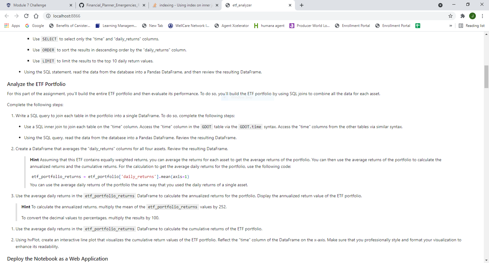
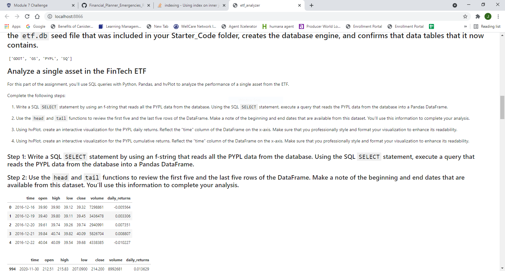
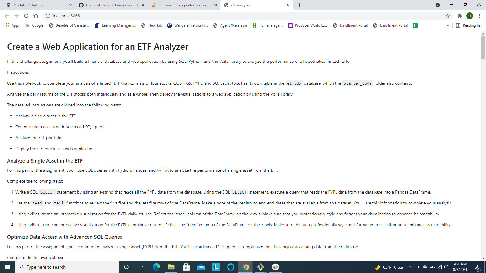

# analyzing_ETF
Financial database and web application that analyzes ETF's using sql to pull the data and filters it through various calculations. Uses hvplot to show data in interactive charts.

# Technologies

This project leverages python 3.7

# Screenshots

# Libraries:

numpy 
pandas
hvplot.pandas
sqlalchemy

# Usage

To use the application simply clone the repository and run through the cells using the play all button or go through your terminal and enter 'voila etf_analyzer.ipynb' in the folder that contains the file after you cloned the repository.

# Contributors

Created by Jose Medina
